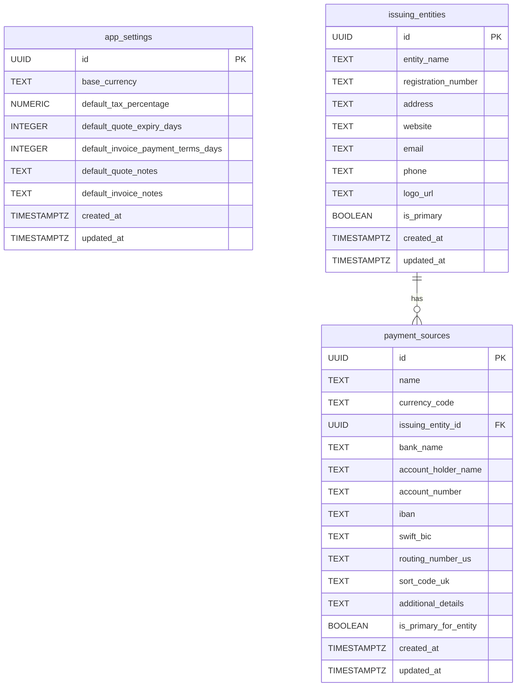

# Settings Page Development Plan

This document outlines the plan for developing the Settings page for the AgeQuant CRM v3 application.

## 1. Project Understanding Summary

The project currently has core modules for Customers, Products (with base and additional currency prices), and a foundational understanding of multi-currency needs, including an FX API. Detailed UI specifications exist in `docs/front-end-ui.md`, and outstanding pricing/FX work is documented in `pricing_fx_product_outstanding_work.md`.

**Key Missing Components for Settings:**
*   Dedicated database tables for `app_settings` (global defaults), `issuing_entities`, and `payment_sources`.
*   UI implementation for the `/settings` routes.
*   Server-side logic (API routes/server actions) for managing settings data.
*   Mechanism for other modules to reliably fetch configured settings (especially System Base Currency).
*   Logo upload functionality for issuing entities.

## 2. Detailed Plan

### Step 1: Define Database Schemas for Settings

**Goal:** Create SQL migration scripts for the new tables required for settings.

**Tables & Key Fields:**

*   **`app_settings`** (or similar, e.g., `system_defaults`):
    *   This table will store global application defaults. A key-value approach or a single-row table with dedicated columns can be used.
    *   **Option 1 (Key-Value):**
        *   `key` (TEXT, PRIMARY KEY, e.g., 'base_currency', 'default_tax_percentage')
        *   `value` (TEXT)
    *   **Option 2 (Dedicated Columns - preferred for type safety if settings are fixed):**
        *   `id` (SERIAL or UUID, PK - if single row, can be fixed)
        *   `base_currency` (TEXT, e.g., 'USD', NOT NULL, CHECK constraint for allowed currencies)
        *   `default_tax_percentage` (NUMERIC(5,2), NOT NULL, CHECK (value >= 0 AND value <= 100))
        *   `default_quote_expiry_days` (INTEGER, NOT NULL, CHECK (value >= 0))
        *   `default_invoice_payment_terms_days` (INTEGER, NOT NULL, CHECK (value >= 0))
        *   `default_quote_notes` (TEXT, nullable)
        *   `default_invoice_notes` (TEXT, nullable)
        *   `created_at` (TIMESTAMPTZ, default now())
        *   `updated_at` (TIMESTAMPTZ, default now())
    *   *Decision: Option 2 (Dedicated Columns) is generally preferred for better type safety and easier querying if the set of global settings is well-defined, as it is here.*

*   **`issuing_entities`**:
    *   `id` (UUID, PRIMARY KEY, default `uuid_generate_v4()`)
    *   `entity_name` (TEXT, NOT NULL)
    *   `registration_number` (TEXT, nullable)
    *   `address` (TEXT, nullable)
    *   `website` (TEXT, nullable)
    *   `email` (TEXT, nullable)
    *   `phone` (TEXT, nullable)
    *   `logo_url` (TEXT, nullable)
    *   `is_primary` (BOOLEAN, NOT NULL, default FALSE)
    *   `created_at` (TIMESTAMPTZ, default now(), NOT NULL)
    *   `updated_at` (TIMESTAMPTZ, default now(), NOT NULL)
    *   *Constraint: Ensure only one entity can be marked as `is_primary` (this might require application-level logic or a more complex SQL constraint/trigger).*

*   **`payment_sources`**:
    *   `id` (UUID, PRIMARY KEY, default `uuid_generate_v4()`)
    *   `name` (TEXT, NOT NULL) - User-friendly name for this payment source.
    *   `currency_code` (TEXT, NOT NULL, CHECK constraint for allowed currencies)
    *   `issuing_entity_id` (UUID, NOT NULL, FOREIGN KEY REFERENCES `issuing_entities(id)` ON DELETE CASCADE)
    *   `bank_name` (TEXT, nullable)
    *   `account_holder_name` (TEXT, nullable)
    *   `account_number` (TEXT, nullable) - Primary account identifier.
    *   `iban` (TEXT, nullable) - International Bank Account Number.
    *   `swift_bic` (TEXT, nullable) - SWIFT/BIC code.
    *   `routing_number_us` (TEXT, nullable) - For US-specific ABA routing numbers.
    *   `sort_code_uk` (TEXT, nullable) - For UK-specific sort codes.
    *   `additional_details` (TEXT, nullable) - For other relevant bank/payment details.
    *   `is_primary_for_entity` (BOOLEAN, NOT NULL, default FALSE)
    *   `created_at` (TIMESTAMPTZ, default now(), NOT NULL)
    *   `updated_at` (TIMESTAMPTZ, default now(), NOT NULL)
    *   *Constraint: Ensure only one payment source per `issuing_entity_id` can be marked as `is_primary_for_entity` (unique partial index or application logic).*

**Mermaid Diagram:**

### Step 2: Develop Server-Side Logic (API Routes/Server Actions)

**Goal:** Create endpoints to manage (CRUD) the new settings data and provide access functions.

**Actions:**
*   **`app_settings`:**
    *   Action to fetch all current `app_settings` (or the single row).
    *   Action to update `app_settings`.
*   **`issuing_entities`:**
    *   CRUD server actions (create, read list, read single, update, delete).
    *   Logic to handle `is_primary` constraint (e.g., when one is set to primary, others are set to false).
*   **`payment_sources`:**
    *   CRUD server actions.
    *   Logic to handle `is_primary_for_entity` constraint.
*   **Utility Functions:**
    *   `getSystemBaseCurrency(): Promise<string>`
    *   `getDefaultTaxPercentage(): Promise<number>`
    *   `getDefaultQuoteExpiryDays(): Promise<number>`
    *   (and similar for other defaults)
    *   These functions will encapsulate fetching logic from the `app_settings` table for easy use across the application.

### Step 3: Implement UI for Settings Page

**Goal:** Build the React components based on `docs/front-end-ui.md` (Section 7: Settings).

**Structure & Routes (`docs/front-end-ui.md:192`):**
*   Main Settings Layout (`/settings`) with tab-based navigation.
*   **Defaults Tab (`/settings/defaults`):**
    *   Form fields for: Base Currency (dropdown from fixed list), Tax % (numeric input 0-50), Quote Expiry (days, numeric), Invoice Payment Terms (days, numeric), Default Quote Notes (textarea), Default Invoice Notes (textarea).
    *   Save button to update these settings via server action.
*   **Issuing Entities Tab (`/settings/entities`):**
    *   Data table displaying existing entities (`entity_name`, `email`, `phone`, `is_primary`).
    *   "Add New Entity" button opening a dialog/modal with form fields: Entity Name, Registration #, Address, Website, Email, Phone, Logo upload (see Step 5).
    *   Actions per entity: Edit, Delete, Set as Primary.
*   **Payment Sources Tab (`/settings/payment-sources`):**
    *   Data table displaying existing payment sources (`name`, `currency_code`, `bank_name`, `account_number`, `issuing_entity_name`, `is_primary_for_entity`).
    *   "Add New Payment Source" button opening a dialog/modal with form fields: Name, Currency, Issuing Entity (dropdown of existing entities), Bank Name, Account Holder Name, Account #, SWIFT/IBAN, Routing # (US), Sort Code (UK), Additional Details.
    *   Actions per source: Edit, Delete, Set as Primary for its entity.

### Step 4: Integrate Settings into Core Modules

**Goal:** Update existing modules (Products, Invoices, Quotes, Customers) to utilize the newly configurable settings.

**Key Integrations:**
*   **Product Module (`app/products/actions.ts`, `components/products/product-form.tsx`):**
    *   Use the configured System Base Currency for the `base_price` field label.
    *   Server-side validation in `app/products/actions.ts` to prevent an `additional_price` from being saved if its currency matches the System Base Currency.
*   **Invoice & Quote Modules (`app/invoices/new/page.tsx`, `app/quotes/new/page.tsx`, related server actions):**
    *   Pre-fill "Issuing Entity" with the primary entity from settings.
    *   Once an entity is selected, pre-fill "Payment Source" with the primary source for that entity (for Invoices).
    *   Pre-fill "Issue Date" (today), "Due Date" (Issue Date + Default Invoice Payment Terms), "Expiry Date" (Issue Date + Default Quote Expiry Days).
    *   Pre-fill "Currency" (e.g., from customer preference or system base currency).
    *   Pre-fill "Tax %" with the default tax percentage.
    *   Pre-fill "Notes" with default quote/invoice notes.
    *   When calculating line item totals where product `base_price` is used and document currency differs from System Base Currency, use the configured System Base Currency to correctly call the `/api/fx` endpoint.
*   **Customer Module (Consideration):**
    *   If a system-wide default preferred currency is desired (not currently in spec but related to `app_settings`), it could be used here.

### Step 5: Implement Logo Upload for Issuing Entities

**Goal:** Allow users to upload and associate logos with issuing entities.

**Tasks:**
*   Choose a storage solution (e.g., Supabase Storage).
*   Implement a file upload component in the "Issuing Entities" form.
*   Server-side logic to handle the upload, store the file, and save the `logo_url` in the `issuing_entities` table.
*   Display the logo in relevant UI parts (e.g., entity list, potentially on generated PDF documents later).

### Step 6: Testing and Refinement

**Goal:** Ensure all settings functionalities work correctly and integrate seamlessly with other application parts.

**Tasks:**
*   Unit and integration tests for server actions and utility functions.
*   End-to-end testing of the settings UI:
    *   Creating, updating, deleting entities and payment sources.
    *   Setting primary entities/sources.
    *   Updating default values.
*   Verify that changes in settings correctly reflect in new Invoices, Quotes, and Product handling.
*   Test edge cases and validation.

## Next Steps

With this plan documented, the next phase would typically involve:
1.  User approval of this plan.
2.  Switching to a "Code" mode or similar for implementation.
3.  Starting with **Step 1: Define Database Schemas for Settings** by creating the necessary Supabase migration files.